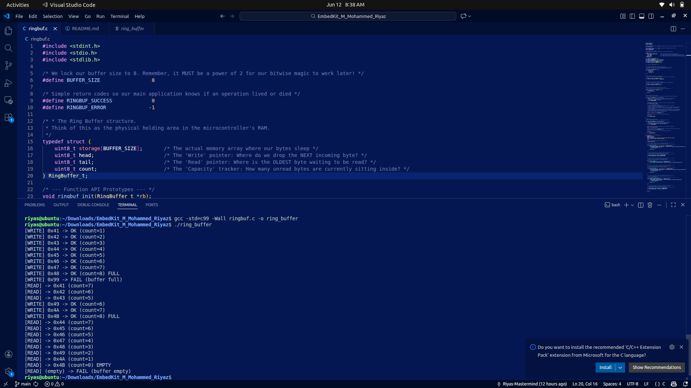

# EmbedKit: Lightweight Circular Buffer (FIFO) Module

**Author:** M Mohammed Riyaz  
**Language:** C (C99 Standard)  
**Target Architecture:** Microcontrollers (ARM Cortex-M, AVR, ESP32, etc.)

---

## 📖 Overview: What is a Ring Buffer?
A **Ring Buffer** (or Circular Queue) is a fixed-size memory array wrapped end-to-end to operate as a continuous loop. It uses a First-In-First-Out (FIFO) data structure. 

In embedded systems, ring buffers are critical for safely passing data between asynchronous domains—such as transferring incoming bytes from a fast Hardware Interrupt Service Routine (like a UART RX interrupt) to the slower background `main()` loop. 

**Key Advantages:**
* **Deterministic Memory:** Uses static allocation (`uint8_t storage[8]`), entirely avoiding `malloc()`, memory leaks, and heap fragmentation.
* **Non-Blocking Logic:** The read and write pointers chase each other in a circle, meaning data can be continuously written and read without shifting elements around in memory.

---

## ⚙️ Core Features & Module Breakdown
This module provides a strictly typed, defensive-programming API for handling 8-bit data streams. 

### 1. Initialization (`ringbuf_init`)
Sets the internal `head` (write index), `tail` (read index), and `count` (capacity tracker) to absolute zero. This ensures the queue is in a known, clean state upon MCU boot or reset before hardware interrupts are enabled.

### 2. State Management (`ringbuf_count`, `ringbuf_is_empty`, `ringbuf_is_full`)
These lightweight getter functions provide the current status of the buffer. By checking these states *before* reading or writing, the application prevents buffer overruns and prevents returning garbage data.

### 3. Data Ingestion (`ringbuf_write`)
Inserts a single byte at the `head` pointer.
* **Safety Protocol:** Refuses to overwrite unread data. If the buffer is full (`count == 8`), the function safely rejects the incoming byte and returns a negative error code.
* **Execution:** Advances the `head` pointer and increments the total `count`.

### 4. Data Extraction (`ringbuf_read`)
Retrieves the oldest unread byte from the `tail` pointer.
* **Safety Protocol:** If the buffer is empty, it returns a precise error code rather than outputting stale data left over in RAM.
* **Execution:** Advances the `tail` pointer and decrements the total `count`.

---

## 🚀 Performance: The Bitwise Wrap-Around Trick
Standard circular buffers use the modulo operator `%` to wrap pointers back to zero when they hit the array limit (e.g., `head = (head + 1) % 8`). 

However, on lightweight microcontrollers lacking a dedicated hardware divider, the `%` operator triggers a slow software division routine that consumes dozens of CPU clock cycles. Inside a high-frequency UART interrupt, this latency can cause dropped packets.

**The Optimization:**
Because this buffer's size is strictly locked to a power of two (`8`), this module replaces the modulo operator with a **Bitwise AND mask**:
```c
rb->head = (rb->head + 1) & (BUFFER_SIZE - 1);
```

Since `8` is binary `1000`, `8 - 1` is `7` (binary `0111`). By bitwise ANDing the incrementing index with `0111`, the upper overflow bit is instantly stripped the moment the index hits `8`, instantly snapping it back to `0`. This operation executes natively in the CPU's Arithmetic Logic Unit (ALU) in exactly one single clock cycle.

---

## 📊 Output Validation
The `main()` sequence executes a rigorous test of the buffer's boundary conditions, including filling the buffer, attempting an illegal write when full, performing partial reads, dynamically reusing freed slots, and attempting an illegal read when empty.



**Expected Trace:**
* **Writes:** Successfully pushes `0x41` through `0x48` until `count=8 (FULL)`.
* **Overflow Protection:** Pushing `0x99` into the full buffer results in a safe `FAIL`.
* **Partial Draining:** Reading 3 bytes retrieves the oldest data (`0x41`, `0x42`, `0x43`) and drops the count to 5.
* **Slot Reuse:** Writing 3 new bytes (`0x49`, `0x4A`, `0x4B`) successfully utilizes the newly freed RAM slots.
* **Underflow Protection:** Attempting to read after the buffer reaches `count=0 (EMPTY)` results in a safe `FAIL`.

---

## 🛠️ Build and Execution Instructions

This project is written in strictly compliant C99 and is designed to compile cleanly without any warnings or errors. 

### Prerequisites
Ensure you have a standard C compiler like GCC (GNU Compiler Collection) installed on your system. You can verify your installation by running:
```bash
gcc --version
```
### Ring Buffer Implementation

This project demonstrates a simple **Ring Buffer (Circular Buffer)** implementation in C, including boundary-condition testing for overflow and underflow protection.

## Step 1: Compilation

Open your terminal, navigate to the directory containing `ringbuf.c`, and run the following strict build command:

```bash
gcc -Wall -std=c99 ringbuf.c -o ring_buffer
```

### Command Breakdown

- **`gcc`**  
  Invokes the GNU C Compiler.

- **`-Wall`**  
  Enables all compiler warning messages. A clean build here demonstrates defensive programming and memory safety.

- **`-std=c99`**  
  Forces the compiler to strictly adhere to the C99 standard, ensuring cross-platform compatibility for microcontrollers.

- **`-o ring_buffer`**  
  Generates the final executable file named `ring_buffer`.

> **Note:**  
> A successful compilation will return absolutely no output to the terminal. This confirms that the code produced **zero errors** and **zero warnings**.

## Step 2: Execution

Once compiled successfully, run the executable:

```bash
./ring_buffer
```

## Step 3: Verification

Upon execution, the terminal will print the complete boundary-condition test sequence.

The expected behavior includes:

- Buffer fills until capacity is reached.
- Overflow write attempt is rejected safely.
- Data is read in FIFO order.
- Additional writes after reads are accepted correctly.
- Underflow read attempt is rejected safely.

Example output:

```plaintext
...
[READ] -> 0x4B (count=0) EMPTY
[READ] (empty) -> FAIL (buffer empty)
```